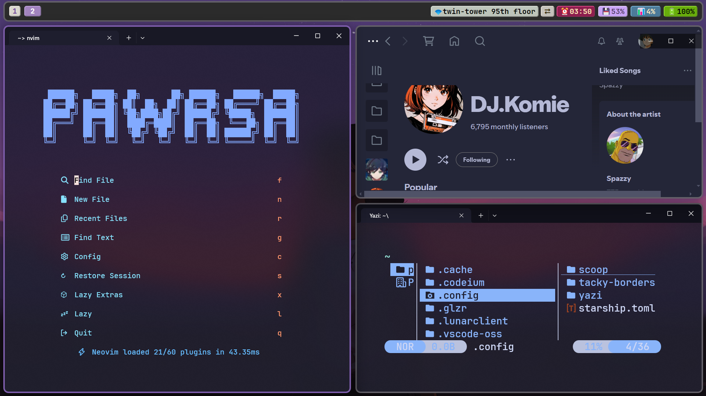

# glazewm-config


# dependcy(need to add this tool Execution file path to `Path` env)
- [autohotkey-v1](https://www.autohotkey.com/)
- [tacky-borders](https://github.com/lukeyou05/tacky-borders)
- [AltSnap](https://github.com/alex-ds13/AltSnap)
- [flameshot](https://github.com/flameshot-org/flameshot)
- [wt](https://github.com/microsoft/terminal)
- [nushell](https://github.com/nushell/nushell)

# some file explain
- scripts/*.ahk
  some mouse action bind and disable Lwin key open system menu
- shellexec.exe(Administrator permissions required
# modify zebar

- 1.you need to install `bun`
```
scoop install bun
```

- 2.after you change something in zebar, you need to rebuild
```
cd $env:HOMEPATH\.glzr\zebar\mybar
bun install
bun run build
```

- 3.restart or reload your zebar
